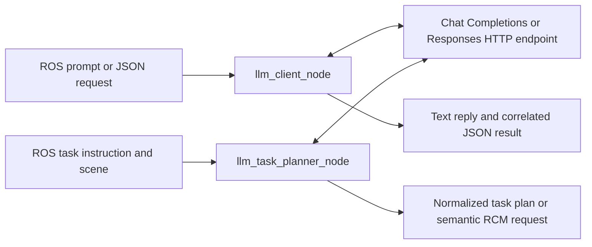

# llm_ros

[](https://github.com/jackysqing-max/llm_ros/actions/workflows/ci.yml)
[](LICENSE)

A standalone **ROS 2 LLM communication module**. Send text or a message envelope
from ROS, call an HTTP model endpoint, and receive the model's reply. It also
provides the task-planning interface extracted from
[vla_simu_workspace](https://github.com/jackysqing-max/vla_simu_workspace), including
its original topic names and plan normalization helpers.

[Deployment](docs/deployment.md) · [Interfaces](docs/interfaces.md) ·
[Validation](docs/validation.md) · [Examples](docs/examples.md) · [Chat demo](docs/chat_demo.md)



## What is included

| Component | Purpose |
| --- | --- |
| `llm_client_node` | General prompt/message communication, request IDs, bounded queue, and result/error messages. |
| `llm_task_planner_node` | Original instruction-to-plan interface with scene context, plan normalization, and optional deterministic fallback. |
| `llm_task_cli` | Interactive or one-shot publisher for the planner interface. |
| `llm_chat_demo` | ROS application example: one-shot questions, interactive conversation, request correlation, and timeouts. |
| `llm_ros.http_client` | Python-standard-library HTTP client reusable without ROS. |
| Launch and YAML profiles | Qwen3/vLLM, Responses API, and semantic RCM planning. |
| Deployment tools | Native ROS setup, Qwen3 serving helper, endpoint check, Dockerfile, and Compose. |
| Validation tools | Unit tests, deterministic mock endpoint, installed-node smoke tests, and GitHub Actions. |

The ROS nodes require **ROS 2 Humble and Python 3.10** on the validated Ubuntu 22.04
baseline. HTTP transport uses the Python standard library; the ROS environment does
not need Torch, Transformers, vLLM, a GPU, or a vendor SDK. A local model service has
its own environment and dependencies. Other ROS distributions are untested.

## Install the ROS package

Install ROS 2 Humble first, then:

```bash
sudo apt-get update
sudo apt-get install -y python3-venv python3-colcon-common-extensions \
  ros-humble-launch-ros ros-humble-ament-index-python ros-humble-std-msgs

mkdir -p "$HOME/llm_ws/src"
git clone https://github.com/jackysqing-max/llm_ros.git "$HOME/llm_ws/src/llm_ros"
cd "$HOME/llm_ws/src/llm_ros"
./scripts/setup.sh "$HOME/llm_ws"

source /opt/ros/humble/setup.bash
source "$HOME/llm_ws/.venv/bin/activate"
source "$HOME/llm_ws/install/local_setup.bash"
```

Source the three environment files in every new ROS terminal. The setup script
only builds this package, and refuses to replace another checkout in the chosen
workspace. To add it to an existing workspace, clone under `src/llm_ros` and run
`python -m colcon build --symlink-install --packages-select llm_ros` with a
ROS-compatible Python interpreter.

## ROS application demo

With the local model service ready, launch the bridge and a one-shot application:

```bash
ros2 launch llm_ros chat_demo.launch.py \
  prompt:="Explain what a ROS 2 node is in one sentence in English."
```

For an interactive conversation, start the normal bridge using
`ros2 launch llm_ros llm.launch.py`, then run `ros2 run llm_ros llm_chat_demo`
in another sourced terminal. The demo communicates through ROS topics, retains
successful conversation turns, and prints correlated replies. Its default system
instruction requests English replies, and all demo prompts and interface text are
in English. Full setup, source
code, custom endpoints, and a mock-only recipe are in the [chat demo guide](docs/chat_demo.md).

## Run without model downloads

Start the deterministic mock endpoint from a sourced ROS environment:

```bash
python -m llm_ros.mock_server --port 8000
```

In another sourced terminal:

```bash
ros2 launch llm_ros llm.launch.py model:=mock-llm
# Another terminal:
ros2 topic echo /llm/response std_msgs/msg/String
ros2 topic pub --once /llm/prompt std_msgs/msg/String "{data: 'Hello from ROS'}"
```

The mock returns predictable text to verify communication. It is not model
inference. For an automated installed-node check:

```bash
python scripts/smoke_test.py
python scripts/smoke_test.py --protocol responses
python scripts/smoke_test.py --mode planner
python scripts/smoke_test.py --mode rcm
```

## Use a local Qwen3 service

Install the model server in a **separate environment**. The serving baseline
extracted from the source project is vLLM 0.19.0 with `Qwen/Qwen3-4B`:

```bash
python3 -m venv "$HOME/.venvs/llm-server"
source "$HOME/.venvs/llm-server/bin/activate"
python -m pip install --upgrade pip
python -m pip install -r requirements-server.txt
./scripts/start_qwen3_vllm.sh
```

In the sourced ROS environment, wait until `/health` succeeds, then start the client:

```bash
curl --fail http://127.0.0.1:8000/health
python scripts/check_endpoint.py
ros2 launch llm_ros llm.launch.py
```

To use the original planner instead:

```bash
ros2 launch llm_ros llm.launch.py mode:=planner
# Another sourced terminal: provide scene context for the fixed-target planner.
ros2 topic pub --once /scene/objects_json std_msgs/msg/String \
  '{"data": "{\"objects\": [{\"label\": \"red cube\", \"visible\": true, \"confidence\": 1.0}]}"}'
ros2 topic echo /llm_task/plan_json std_msgs/msg/String --qos-durability transient_local
# Another sourced terminal:
ros2 run llm_ros llm_task_cli --once "Hover above the red cube." \
  --wait-status-prefix planned --fail-status-prefix planning_failed
```

Planning produces JSON. This package does not contain a robot executor, depth
fusion, or motion controllers. Its preserved plan format is documented in
[interfaces](docs/interfaces.md). The supplied planner profiles disable fallback
so model errors remain visible; deterministic fallback can be enabled explicitly.
The fixed-cube profile grounds its plan in scene context. Use the scene registry
example above, or enable `open_vocabulary_targets` in custom YAML to let perception
ground object phrases later.

## Use a Responses API service

Supply your own authorized API key through the environment:

```bash
export OPENAI_API_KEY="YOUR_API_KEY"
ros2 launch llm_ros llm.launch.py backend:=responses
# Use mode:=planner for the extracted planning interface.
```

The supplied profile preserves the source project's `gpt-5-mini` setting; choose
the endpoint and model available to your account using launch arguments or YAML.
Actual prompts are sent only when a ROS input message arrives. The bundled endpoint
check and real-endpoint smoke test also send inference requests when explicitly run.

## Verification

Pure unit tests require no ROS or model weights:

```bash
python -m pip install -r requirements-test.txt
python -m pytest -q
```

Against a separately running real model:

```bash
python scripts/smoke_test.py --endpoint http://127.0.0.1:8000/v1/chat/completions \
  --model Qwen/Qwen3-4B
python scripts/smoke_test.py --mode planner \
  --endpoint http://127.0.0.1:8000/v1/chat/completions --model Qwen/Qwen3-4B
```

The smoke test uses ROS domain 96 by default, checks the installed launch file,
cleans up its own ROS processes, and leaves a separately started model server under
its owner's control. See the [validation record](docs/validation.md) for results and limits.

## License and sources

ROS integration code is **Apache-2.0**; see [LICENSE](LICENSE) and [NOTICE](NOTICE).
Model weights and API credentials are obtained separately. Models, vLLM, and remote
services retain their respective licenses or terms. All documentation is in English;
the original deterministic instruction parser retains multilingual text aliases.

Protocol references:
[official OpenAI Responses text guide](https://developers.openai.com/api/docs/guides/text?api-mode=responses),
[official OpenAI structured outputs guide](https://developers.openai.com/api/docs/guides/structured-outputs?api-mode=responses),
[vLLM 0.19.0 OpenAI-compatible server](https://docs.vllm.ai/en/v0.19.0/serving/openai_compatible_server/).
