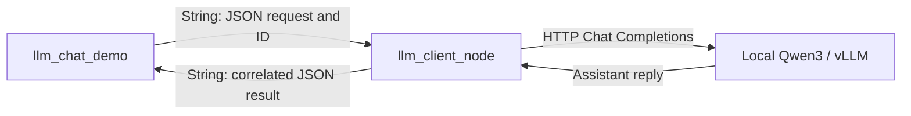

# ROS 2 chat demo

The demo is a ROS application node that publishes requests and subscribes to replies.
`llm_client_node` forwards those requests to the separately running local model.
The application contains no HTTP client, model runtime, or credentials.



Source: [llm_chat_demo.py](../llm_ros/llm_chat_demo.py).
Launch: [chat_demo.launch.py](../launch/chat_demo.launch.py).

## Build and prepare the model

From the repository root, build or rebuild to register the new executable:

```bash
./scripts/setup.sh "$HOME/llm_ws"
source /opt/ros/humble/setup.bash
source "$HOME/llm_ws/.venv/bin/activate"
source "$HOME/llm_ws/install/local_setup.bash"
```

In a separate model-serving terminal, use the environment installed following
[deployment](deployment.md):

```bash
cd "$HOME/llm_ws/src/llm_ros"
source "$HOME/.venvs/llm-server/bin/activate"
./scripts/start_qwen3_vllm.sh
```

The default model is `Qwen/Qwen3-4B`, served on `127.0.0.1:8000`. For an existing
service, use its full Chat Completions endpoint and registered model name below.
Wait for readiness from the ROS terminal:

```bash
curl --fail http://127.0.0.1:8000/health
```

## One command: launch the ROS bridge and demo

```bash
ros2 launch llm_ros chat_demo.launch.py \
  prompt:="Explain what a ROS 2 node is in one sentence."
```

This starts the bridge and demo, waits for ROS discovery, sends a request, prints
the matching reply, and shuts down both ROS nodes. It leaves the model service
running. The launch uses `/llm_demo/*` topics, so the default `/llm/*` application
topics remain available for a separately running bridge.

Example output; generated text depends on the model:

```text
[USER] Explain what a ROS 2 node is in one sentence.
[REQUEST] <unique request ID>
[STATUS] queued
[STATUS] running
[LLM] A ROS 2 node is a process that performs a task and communicates with other nodes.
```

For a service on another port:

```bash
ros2 launch llm_ros chat_demo.launch.py \
  api_base_url:=http://127.0.0.1:18080/v1/chat/completions \
  model:=Qwen/Qwen3-4B prompt:="Reply with READY."
```

| Launch argument | Default | Purpose |
| --- | --- | --- |
| `prompt` | ROS node explanation | One question to send. |
| `params_file` | Installed `config/client_qwen3.yaml` | Bridge settings, including model and HTTP timeout. |
| `api_base_url`, `model` | Empty | Optional overrides; otherwise keep the YAML values. |
| `topic_prefix` | `/llm_demo` | Shared topic prefix for both ROS nodes; choose another for simultaneous demos. |
| `response_timeout_sec` | `120.0` | Time to wait for the matching result, including bridge queue time. |
| `discovery_timeout_sec` | `10.0` | Time to find a request subscriber and response publisher. |

## Interactive conversation

Source the ROS environment in each terminal. First start the regular bridge:

```bash
ros2 launch llm_ros llm.launch.py
```

In another sourced terminal:

```bash
ros2 run llm_ros llm_chat_demo
```

Type a question at `you>`. Follow-up questions include up to four previous
successful user/assistant turns. Type `:reset` to clear that history and `:quit`
or `:exit` to exit. EOF also exits. The demo stores history in its own process;
the bridge itself remains stateless. Failed turns are not retained. Large prompts
may still exceed the model's token context or the bridge's request byte limit.

Useful standalone options:

```bash
# Send once through an already running bridge.
ros2 run llm_ros llm_chat_demo --once "Reply with READY." --timeout 120
# Disable conversation history.
ros2 run llm_ros llm_chat_demo --history-turns 0
# Choose a system instruction and retain two previous turns.
ros2 run llm_ros llm_chat_demo --system-prompt "Answer concisely." --history-turns 2
```

The standalone node uses `/llm/request_json`, `/llm/response_json`, and `/llm/status`.
Override its read-only topic parameters to match a custom bridge:

```bash
ros2 run llm_ros llm_chat_demo --once "Hello" --ros-args \
  -p request_topic:=/my_llm/request_json \
  -p response_json_topic:=/my_llm/response_json \
  -p status_topic:=/my_llm/status
```

All topics use `std_msgs/msg/String`, reliable/volatile QoS, depth 10. JSON replies
are matched using the generated request ID. Other callers' replies and late replies
from previous timed-out requests are ignored. One-shot mode exits with code 0 on a
valid reply, 1 on a bridge error or timeout, and 130 on interruption. Invalid CLI
arguments use code 2. Interactive mode prints an error and accepts another question.
The one-shot launch also fails when the demo exits with an error.

## Use the node from application code

With the regular bridge already running:

```python
import rclpy
from llm_ros.llm_chat_demo import LlmChatDemo

rclpy.init()
node = LlmChatDemo(history_turns=2)
try:
    reply = node.chat("Remember the token ros-demo-42. Reply with ACK.")
    print(reply)
    follow_up = node.chat("What token did I ask you to remember?")
    print(follow_up)
finally:
    node.destroy_node()
    rclpy.shutdown()
```

`chat()` spins this node while waiting. The core pattern is in `chat()` and
`on_result()`: publish a JSON message with an ID, then accept the matching result.
Use those callbacks as the example when integrating the topic interface into an
existing ROS application that manages its own executor.

## Test without a model download

Run the mock service in one sourced terminal:

```bash
python -m llm_ros.mock_server --port 8000
```

Run the same launch in another terminal with `model:=mock-llm`. Its `MOCK:` reply
verifies ROS communication and is not model inference. For automated checks from
the repository root:

```bash
python scripts/demo_smoke_test.py
python scripts/demo_smoke_test.py \
  --endpoint http://127.0.0.1:8000/v1/chat/completions --model Qwen/Qwen3-4B
```

The mock check covers the installed one-shot launch, automatic shutdown, retained
history, reset, stateless mode, HTTP errors, reply timeout, and missing ROS bridge.
The real check sends a one-shot request and a two-turn token-recall conversation.
Both checks use domain 97 by default, stop their own ROS processes, and leave an
external model service running. See [validation](validation.md) for recorded results.
